# Week-12
#week-12 lab
##1

sudo useradd controller

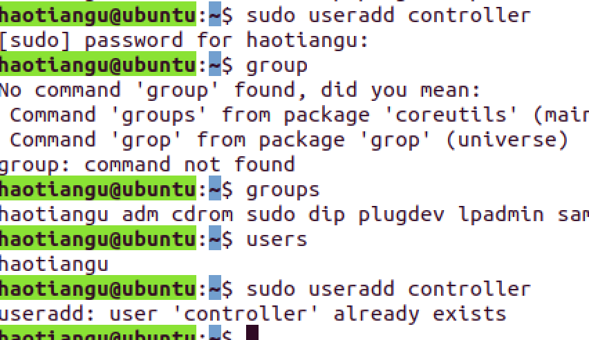

##2

sudo usermod -aG sudo haotiangu

##3

sudo userdel usa-spa

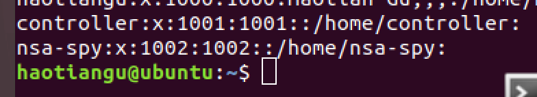

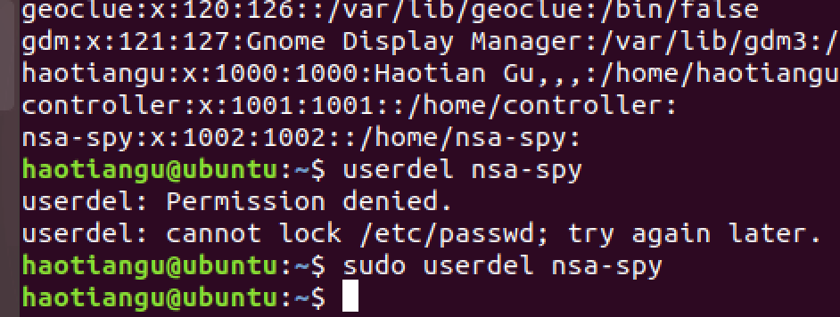

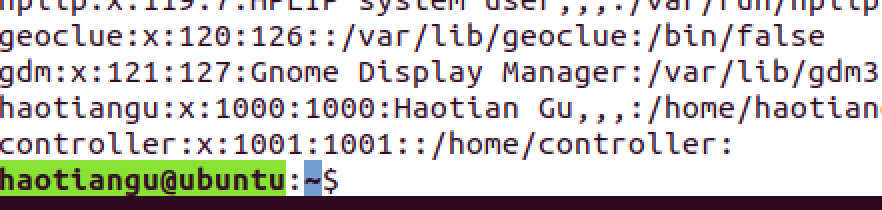

##4
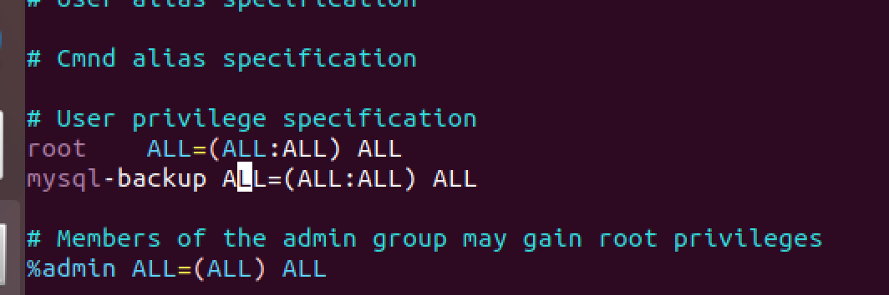

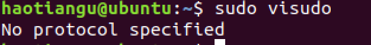
##5
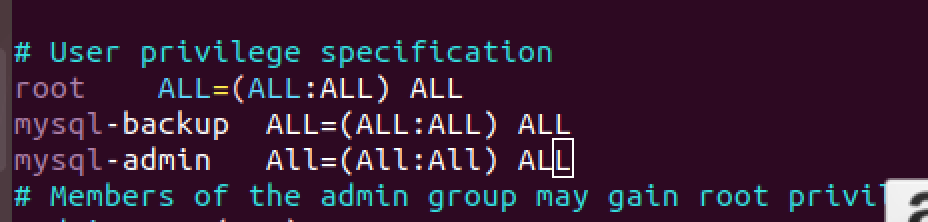
##6
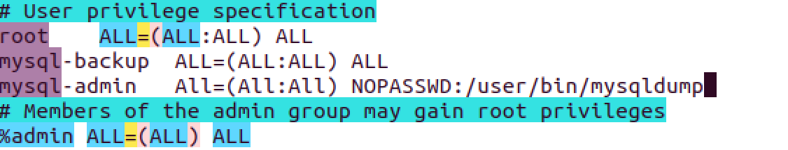
##7
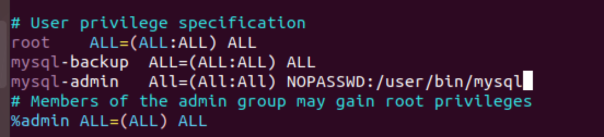
##8

##9
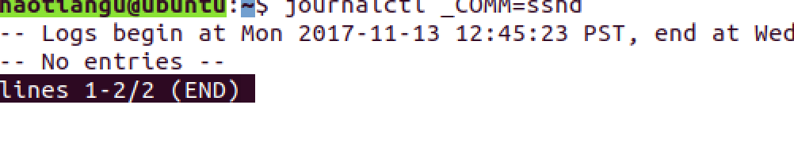

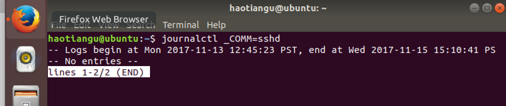
##10
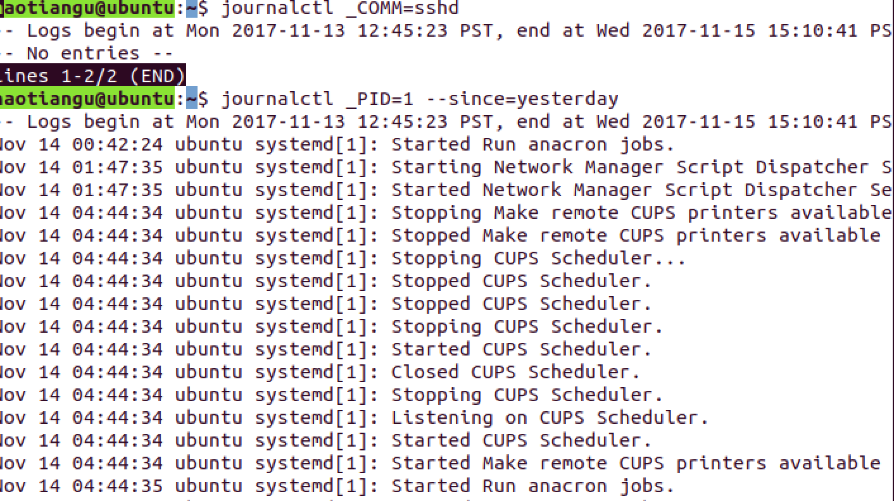
##11
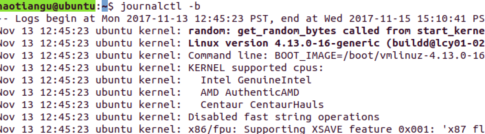
##12

edit /etc/systemd/journald.conf and change the Storage= volatile

##13

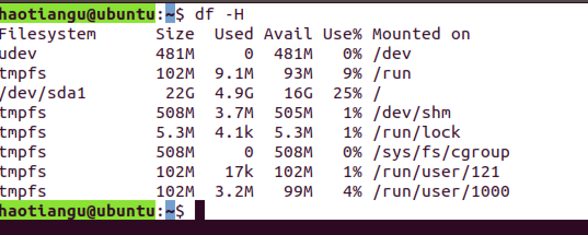

##14

###### * 2 * * 0 mysqldump –xml -u root world City

##15

###### 0 0 1 * * mysqldump –xml -u root world City

##16

###### */45 * * * * mysqldump –xml -u root world City

##17

###### */45 0 * * 0 mysqldump –xml -u root world City

##18

###### 45 2 * * 3 mysqldump –xml -u root world City

##19

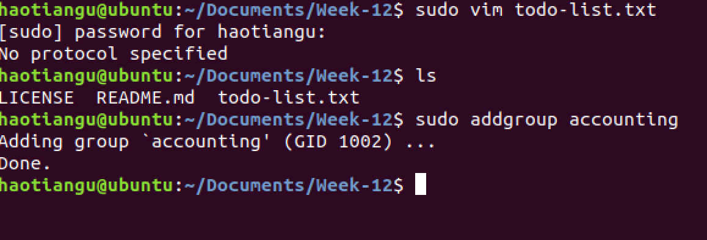

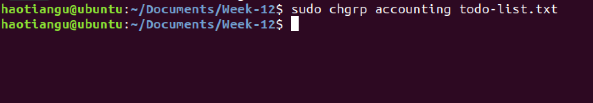

##20

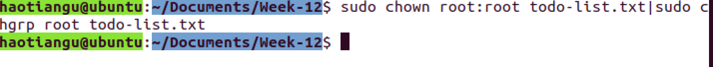

